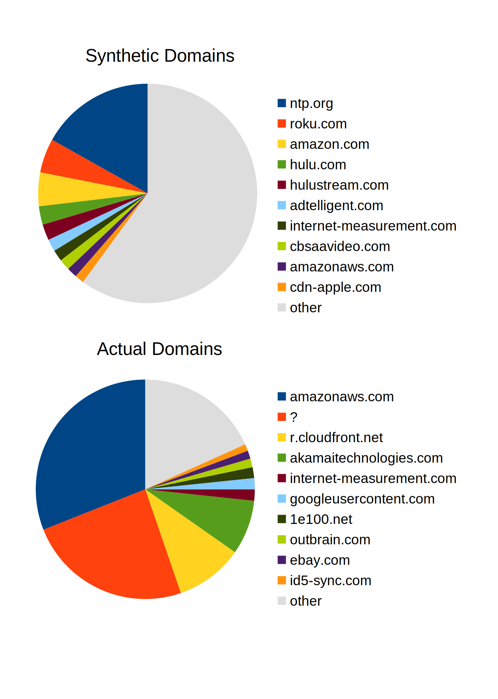

## Synthesized vs Actual PTR records Provide Very Different Views

TLDR: The big players don't make PTR records to make life easy for you, and they're only getting bigger.

I've been running _Rear View RPZ_ for a while now and have had a decent chance to look at
and play with the data. Consolidation has only grown more apparent while I wasn't paying attention!
If you have any interest in what domains are being communicated with by your networks and devices, it
behooves you to provision that resource, today. I recommend something which is ingesting data which
is as local as possible, whether you do that with something like _Zeek_ or telemetry from local caching
resolvers is up to you. Yes sure there are commercial reverse DNS offerings, but ___all politics is local___
    
So do you want your politics, or the politics of for example _Amazon_ or _Cloudflare_? What you've got,
what sets you apart, is the traffic on your own network.

### My observation network

* Primarily a SOHO "user" network.
* Not many external clients.
* Using a `CACHE_LIMIT` of 3000 resolutions seems to be adequate (resulting in approximately 2500 addresses).

_Synthetic_ refers to `PTR` records generated from DNS resolution telemetry data, whereas _actual_ refers
to what is returned by an actual reverse DNS lookup.

Canonical domains were extracted from both and utilized for the comparisons which follow.

### Main observations

#### Actual and synthetic distributions are very different

Not only are the **domains** different, the **distribution** is different. The _actual_ domains are
much more concentrated in the hands of a few infrastructure players.

I'm actually mildly amused that _NTP_ ranks as the most frequent resource lookup.

##### Table: Top 20 Synthetic

| domain | occurrences |
| ------ | ----------: |
| ntp.org|	422 |
| roku.com |	126 |
| amazon.com |	124 |
| hulu.com |	68 |
| hulustream.com |	59 |
| adtelligent.com |	45 |
| internet-measurement.com |	42 |
| cbsaavideo.com |	41 |
| amazonaws.com |	38 |
| cdn-apple.com |	34 |
| ebay.com |	32 |
| zemanta.com |	32 |
| revcontent.com |	30 |
| id5-sync.com |	28 |
| alexametrics.com |	26 |
| fwmrm.net |	25 |
| spot.im |	25 |
| live.com |	24 |
| mozilla.com |	24 |
| netflix.com |	23 |

##### Table: Top 20 Actual

| domain | occurrences |
| ------ | ----------: |
| amazonaws.com |	775 |
| ? |	607 |
| r.cloudfront.net |	250 |
| akamaitechnologies.com |	201 |
| internet-measurement.com |	42 |
| googleusercontent.com |	41 |
| 1e100.net |	40 |
| outbrain.com |	32 |
| ebay.com |	30 |
| id5-sync.com |	25 |
| github.com |	24 |
| doctor.com |	12 |
| yahoo.com |	12 |
| nist.gov |	10 |
| comcastbusiness.net |	9 |
| 24shells.net |	8 |
| sucuri.net |	6 |
| 0xt.ca |	5 |
| mattnordhoff.net |	5 |
| chewy.com |	4 |

#### The second-most common actual response is NoAnswer/NXDOMAIN

Take a second look at the _Top 20 Actual_ table and observe that the second entry is `?`. This indicates
that PTR lookups for the addresses in question returned `NoAnswer` or `NXDOMAIN` (in DNS-speak, there isn't
an answer). __The number of PTR lookups which failed to resolve is larger than most common synthetic domain.__

Chunks of the nonresponsive address space are observed under the control of _Fastly_ and _Cloudflare_ according
to `whois`, although they're not the only contributors.

A sampling of 150 of each of the top two actual respondents is provided as the _CSV_ file [actual-vs-synth.csv](actual-vs-synth.csv)
with the following fields:

* address
* synthetic PTR value
* actual PTR value
* heuristic score

The samplings were selected for their relatively high heuristic scores, representing that they have been seen
"more frequently" in the environment.

#### 407 synthesized versus 307 actual domains

Again underscoring the consolidation story, the total number of synthesized domains is significantly larger
the number of observed actual domains. The top four _actual_ domains account for 73% of the addresses.
